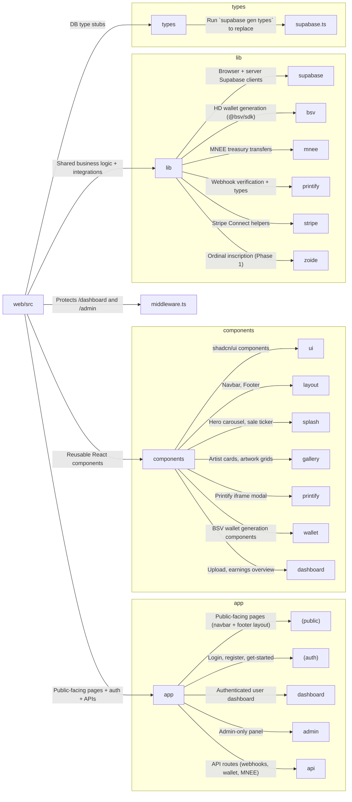

# Project schema test

```mermaid
flowchart LR
    A["web/src"]

    A -->|"Public-facing pages + auth + APIs"| B["app"]
    A -->|"Reusable React components"| C["components"]
    A -->|"Shared business logic + integrations"| D["lib"]
    A -->|"Protects /dashboard and /admin"| E["middleware.ts"]
    A -->|"DB type stubs"| F["types"]

    subgraph APP["app"]
        B -->|"Public-facing pages (navbar + footer layout)"| B1["(public)"]
        B -->|"Login, register, get-started"| B2["(auth)"]
        B -->|"Authenticated user dashboard"| B3["dashboard"]
        B -->|"Admin-only panel"| B4["admin"]
        B -->|"API routes (webhooks, wallet, MNEE)"| B5["api"]
    end

    subgraph COMPONENTS["components"]
        C -->|"shadcn/ui components"| C1["ui"]
        C -->|"Navbar, Footer"| C2["layout"]
        C -->|"Hero carousel, sale ticker"| C3["splash"]
        C -->|"Artist cards, artwork grids"| C4["gallery"]
        C -->|"Printify iframe modal"| C5["printify"]
        C -->|"BSV wallet generation components"| C6["wallet"]
        C -->|"Upload, earnings overview"| C7["dashboard"]
    end

    subgraph LIB["lib"]
        D -->|"Browser + server Supabase clients"| D1["supabase"]
        D -->|"HD wallet generation (@bsv/sdk)"| D2["bsv"]
        D -->|"MNEE treasury transfers"| D3["mnee"]
        D -->|"Webhook verification + types"| D4["printify"]
        D -->|"Stripe Connect helpers"| D5["stripe"]
        D -->|"Ordinal inscription (Phase 1)"| D6["zoide"]
    end

    subgraph TYPES["types"]
        F -->|"Run `supabase gen types` to replace"| F1["supabase.ts"]
    end
```